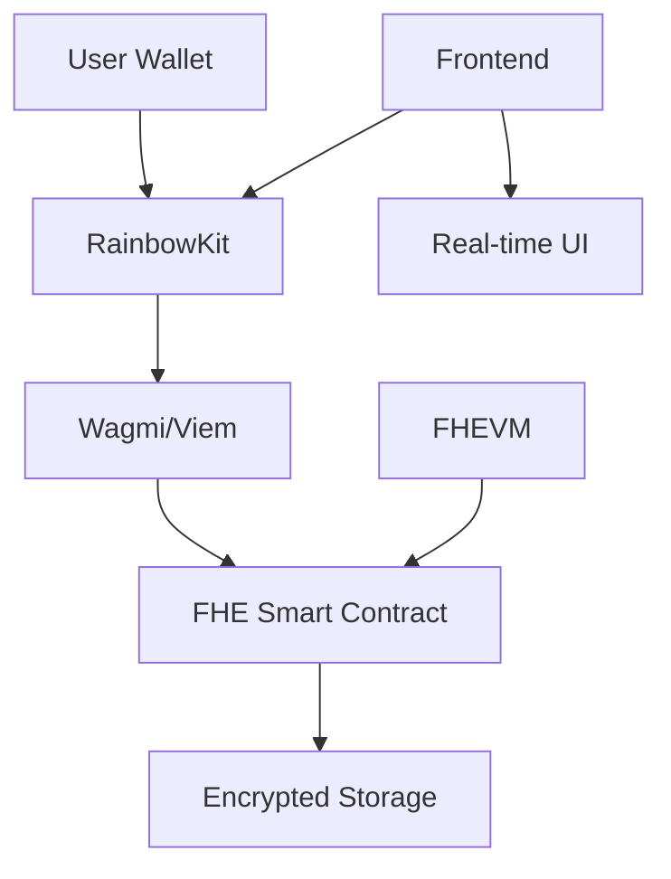

<div align="center">

# 🛡️ Fheture Rewards

### *Privacy-First Loyalty Programs Powered by FHE*

[](https://opensource.org/licenses/MIT)
[](https://www.typescriptlang.org/)
[](https://reactjs.org/)
[](https://vitejs.dev/)
[](https://ethereum.org/)

*Revolutionizing loyalty rewards with Fully Homomorphic Encryption*

</div>

---

## 🌟 What Makes Us Different?

> **Traditional loyalty programs expose your data to competitors. We encrypt everything.**

Fheture Rewards is the world's first **privacy-preserving loyalty platform** that uses Fully Homomorphic Encryption (FHE) to keep your reward data completely private while still allowing you to earn and redeem points seamlessly.

### 🔐 **Privacy by Design**
- Your reward data is **never decrypted** on the blockchain
- Competitors can't see your spending patterns or loyalty status
- You maintain complete control over your personal information

### ⚡ **Seamless Experience**
- Connect any Web3 wallet (MetaMask, Rainbow, WalletConnect, etc.)
- Earn and redeem rewards with a single click
- Real-time encrypted analytics and insights

### 🏗️ **Built for the Future**
- Decentralized architecture ensures no single point of failure
- Smart contracts handle all reward logic with FHE encryption
- Transparent but private - you can verify everything without exposing data

---

## 🚀 Quick Start

### Prerequisites
- **Node.js** 18+ 
- **npm** or **yarn**
- **Web3 Wallet** (MetaMask, Rainbow, etc.)

### Installation

```bash
# Clone the repository
git clone https://github.com/kevinhuangdev/fheture-rewards.git
cd fheture-rewards

# Install dependencies
npm install

# Set up environment variables
cp .env.example .env.local
# Edit .env.local with your configuration

# Start development server
npm run dev
```

### Environment Setup

Create a `.env.local` file with:

```env
VITE_CHAIN_ID=11155111
VITE_RPC_URL=https://sepolia.infura.io/v3/YOUR_INFURA_KEY
VITE_WALLET_CONNECT_PROJECT_ID=YOUR_PROJECT_ID
VITE_INFURA_API_KEY=YOUR_INFURA_KEY
VITE_FHEVM_NETWORK=sepolia
VITE_CONTRACT_ADDRESS=0x0000000000000000000000000000000000000000
```

---

## 🏗️ Architecture



### Tech Stack

| Layer | Technology | Purpose |
|-------|------------|---------|
| **Frontend** | React + TypeScript + Vite | Modern, fast development |
| **UI** | shadcn/ui + Tailwind CSS | Beautiful, accessible components |
| **Blockchain** | Wagmi + Viem | Type-safe Ethereum interactions |
| **Wallets** | RainbowKit | Multi-wallet support |
| **Encryption** | FHEVM | Fully homomorphic encryption |
| **Network** | Ethereum Sepolia | Testnet for development |

---

## 🔧 Smart Contract Features

Our FHE-powered smart contract provides:

- **🔒 Encrypted Reward Storage**: All points and balances encrypted with FHE
- **🎯 Dynamic Tier System**: Automatic tier calculation on encrypted data
- **📊 Private Analytics**: Track performance without exposing user data
- **🔄 Secure Transactions**: Earn and redeem rewards with full privacy
- **✅ Program Verification**: Verified loyalty programs for trust

### Contract Functions

```solidity
// Create a new loyalty program
function createLoyaltyProgram(string name, string description, uint256 expiresAt)

// Earn rewards (encrypted)
function earnRewards(uint256 programId, externalEuint32 points, bytes inputProof)

// Redeem rewards (encrypted)
function redeemRewards(uint256 programId, externalEuint32 points, bytes inputProof)

// Get encrypted user data
function getUserRewardInfo(uint256 programId, address user)
```

---

## 🎨 UI Components

### Wallet Integration
- **Multi-wallet support**: MetaMask, Rainbow, WalletConnect, Coinbase Wallet
- **Network switching**: Automatic Sepolia testnet detection
- **Connection status**: Real-time wallet connection monitoring

### Loyalty Cards
- **Encrypted data display**: Shows encrypted reward information
- **Interactive actions**: Earn/redeem rewards with one click
- **Visual feedback**: Loading states and success animations

### Dashboard
- **Real-time stats**: Encrypted analytics and insights
- **Program overview**: All your loyalty programs in one place
- **Secure transactions**: FHE-protected reward operations

---

## 🚀 Deployment

### Vercel (Recommended)

1. **Connect Repository**
   - Go to [Vercel Dashboard](https://vercel.com)
   - Import `kevinhuangdev/fheture-rewards`

2. **Configure Environment**
   - Add all environment variables from `.env.local`
   - Set build command: `npm run build`
   - Set output directory: `dist`

3. **Deploy**
   - Click "Deploy"
   - Your app will be live in minutes!

### Manual Deployment

```bash
# Build for production
npm run build

# Preview production build
npm run preview

# Deploy to your hosting provider
# Upload the 'dist' folder
```

---

## 🤝 Contributing

We welcome contributions! Here's how to get started:

1. **Fork** the repository
2. **Create** a feature branch: `git checkout -b feature/amazing-feature`
3. **Commit** your changes: `git commit -m 'Add amazing feature'`
4. **Push** to the branch: `git push origin feature/amazing-feature`
5. **Open** a Pull Request

### Development Guidelines

- Follow TypeScript best practices
- Use conventional commit messages
- Add tests for new features
- Update documentation as needed

---

## 📊 Project Status

- ✅ **Core Features**: Complete
- ✅ **Wallet Integration**: Complete
- ✅ **FHE Smart Contract**: Complete
- ✅ **UI Components**: Complete
- 🚧 **Testing**: In Progress
- 🚧 **Documentation**: In Progress

---

## 🔒 Security

- **FHE Encryption**: All sensitive data encrypted with Fully Homomorphic Encryption
- **Smart Contract Audits**: Regular security audits of contract code
- **Wallet Security**: Multi-signature support and secure key management
- **Privacy First**: No user data collection or tracking

---

## 📄 License

This project is licensed under the **MIT License** - see the [LICENSE](LICENSE) file for details.

---

## 💬 Support

- **Issues**: [GitHub Issues](https://github.com/kevinhuangdev/fheture-rewards/issues)
- **Discussions**: [GitHub Discussions](https://github.com/kevinhuangdev/fheture-rewards/discussions)
- **Email**: Create an issue for support

---

<div align="center">

**Built with ❤️ for privacy and decentralization**

[⭐ Star this repo](https://github.com/kevinhuangdev/fheture-rewards) | [🐛 Report Bug](https://github.com/kevinhuangdev/fheture-rewards/issues) | [💡 Request Feature](https://github.com/kevinhuangdev/fheture-rewards/issues)

</div>